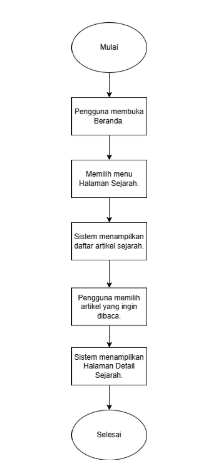
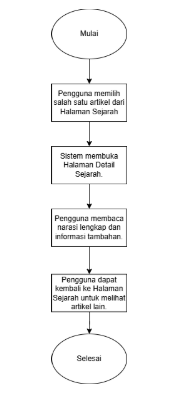
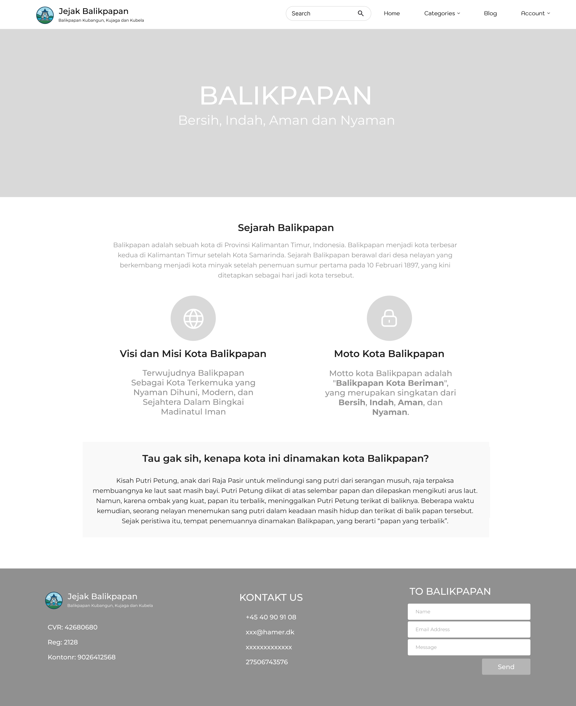
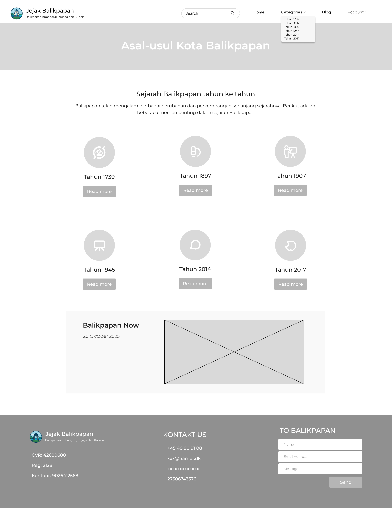
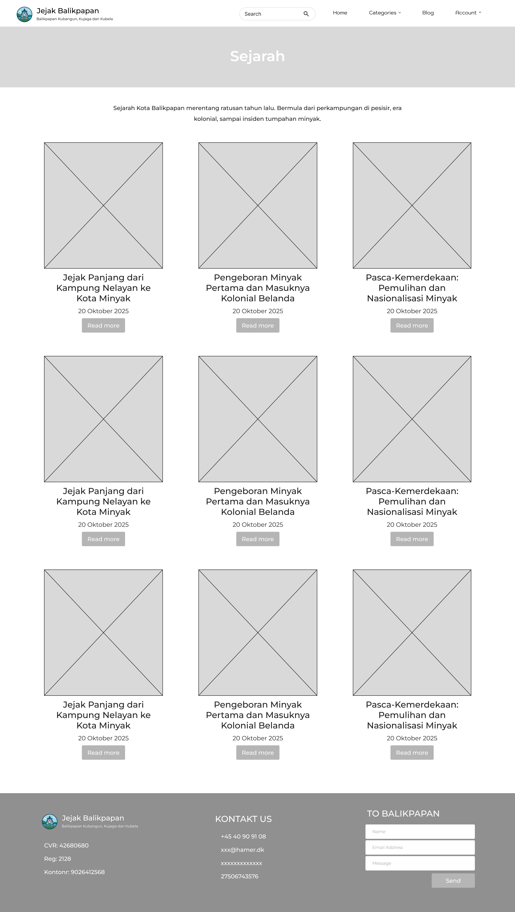

Proposal Proyek Website: Jejak Balikpapan
Dokumen Proposal

## Deskripsi Aplikasi
Jejak Balikpapan merupakan platform web arsip digital yang bertujuan untuk mendokumentasikan, melestarikan, dan menyajikan sejarah Kota Balikpapan secara interaktif dan mudah diakses. Website ini diharapkan menjadi sumber utama informasi sejarah lokal, menghubungkan generasi masa kini dengan peristiwa masa lalu melalui pendekatan digital. 
Platform ini menyajikan artikel sejarah dan foto arsip yang dikurasi secara tematik untuk menciptakan pengalaman belajar yang menarik. Dengan tampilan modern dan navigasi yang mudah, pengguna dapat menelusuri jejak sejarah Balikpapan dari masa pra-kolonial hingga era modern.

## Target User
Pelajar dan Mahasiswa: Sebagai media pembelajaran dan referensi utama untuk tugas sekolah, penelitian, maupun skripsi yang berfokus pada sejarah lokal.
Instansi Pemerintah dan Lembaga Kebudayaan: Sebagai sarana edukasi publik dan promosi warisan budaya kota melalui tampilan digital yang modern.
Masyarakat Umum dan Komunitas Lokal: Sebagai wadah eksplorasi sejarah daerah serta media partisipasi publik melalui fitur “Kontribusi Cerita”.

## Fitur-Fitur Utama
Manajemen Konten Sejarah (CRUD & Kategori): Sebuah sistem back-end yang komprehensif bagi admin untuk mengelola (membuat, membaca, mengubah, dan menghapus) semua artikel dan data sejarah. Fitur ini juga mencakup kemampuan untuk membuat Kategori Sejarah, memungkinkan pengelompokan konten berdasarkan era, tema, atau jenis peristiwa.

# Penyajian Konten yang Informatif (Tampilan Halaman & Detail): 
Website akan menampilkan daftar sejarah dalam format yang mudah dinavigasi (Tampilan Halaman Sejarah). Setiap item dapat di-klik untuk membuka Tampilan Detail Sejarah, yang menyajikan narasi lengkap, galeri foto, dan informasi terkait lainnya secara mendalam.
Pencarian Sejarah: Sebuah fungsi pencarian yang kuat dan mudah digunakan, memungkinkan pengunjung untuk dengan cepat menemukan informasi sejarah berdasarkan kata kunci, nama peristiwa, atau kategori.

# Dasbor Administrasi (Login, Register & Dashboard): 
Area manajemen khusus yang aman dan hanya bisa diakses oleh admin melalui sistem Login dan Register. Dashboard Admin ini menjadi pusat kendali untuk mengelola konten, pengguna, dan semua aspek fungsional website.

# User Flow Diagram (Alur Pengguna)
Alur 1: Alur 1: Pengguna Menjelajahi Halaman Sejarah
Pengguna membuka Beranda.
Memilih menu Halaman Sejarah.
Sistem menampilkan daftar artikel sejarah dalam bentuk kartu atau grid.
Pengguna menggulir dan memilih artikel yang ingin dibaca.
Sistem menampilkan Halaman Detail Sejarah untuk artikel yang dipilih.

Alur 2: Pengguna memilih salah satu artikel dari Halaman Sejarah.
Sistem membuka Halaman Detail Sejarah.
Pengguna membaca narasi lengkap, melihat foto arsip, dan informasi tambahan seperti waktu atau lokasi kejadian.
Pengguna dapat kembali ke Halaman Sejarah untuk melihat artikel lain.

Alur 3: Pengguna membuka Beranda.
Mengetik kata kunci tertentu di kolom Pencarian Sejarah, misalnya “Perang Dunia II”.
Sistem menampilkan hasil pencarian berupa daftar artikel yang relevan.
Pengguna memilih salah satu hasil dan diarahkan ke Halaman Detail Sejarah.

Pengguna membuka Beranda.
Mengetik kata kunci tertentu di kolom Pencarian Sejarah, misalnya “Perang Dunia II”.
Sistem menampilkan hasil pencarian berupa daftar artikel yang relevan.
Pengguna memilih salah satu hasil dan diarahkan ke Halaman Detail Sejarah.

Alur 4: Pengguna Menelusuri Berdasarkan Kategori Sejarah
Pengguna membuka menu Kategori Sejarah.
Memilih salah satu kategori seperti Pra-Minyak, Pendudukan Jepang, atau Era Modern.
Sistem menampilkan Halaman Sejarah berisi artikel sesuai kategori yang dipilih.
Pengguna mengklik salah satu artikel untuk melihat detail peristiwa.

Alur 4: Pengguna Menelusuri Berdasarkan Kategori Sejarah
Pengguna membuka menu Kategori Sejarah.
Memilih salah satu kategori seperti Pra-Minyak, Pendudukan Jepang, atau Era Modern.
Sistem menampilkan Halaman Sejarah berisi artikel sesuai kategori yang dipilih.
Pengguna mengklik salah satu artikel untuk melihat detail peristiwa.

## Wireframe

Header: Logo "Jejak Balikpapan" | Menu Navigasi (Linimasa, Peta, Galeri, Kontribusi, Tentang Kami)

Hero Section: Gambar besar ikonik sejarah Balikpapan (misal: Kilang Minyak tempo dulu) dengan judul besar "Menelusuri Jejak Sejarah Kota Minyak". Di bawahnya ada kolom pencarian.

Bagian "Pilihan Editor": 3 kartu (card) menuju artikel-artikel menarik yang sedang disorot. Setiap kartu berisi gambar, judul, dan ringkasan singkat.

Bagian "Jelajahi Linimasa": Sebuah cuplikan visual dari linimasa interaktif dengan tombol "Jelajahi Sekarang".

Bagian "Kirim Ceritamu": Ajakan singkat untuk berkontribusi, dengan tombol "Mulai Berkontribusi".

Footer: Tautan Cepat | Kontak | Media Sosial.

Detail Peristiwa/Artikel
Header: Sama seperti Beranda.
Judul Artikel: Contoh: "Tragedi Sumur Mathilde: Awal Mula Julukan Kota Minyak".

Gambar Utama: Foto utama yang relevan dengan artikel.
Meta Data: Tanggal Peristiwa | Kategori Era | Penulis.
Isi Artikel: Teks narasi sejarah yang mendalam.
Sidebar Kanan:
Peta Mini: Menampilkan lokasi peristiwa di peta.
Galeri Terkait: Kumpulan 4-6 thumbnail foto terkait artikel.
Artikel Terkait: Daftar tautan ke artikel lain yang relevan.

Header: Sama seperti Beranda.

Judul Halaman: "Linimasa Sejarah Balikpapan".

Konten Utama: Sebuah garis waktu horizontal yang bisa digeser (scroll). Garis waktu dibagi menjadi beberapa era (misal: Pra-Minyak, Era BPM, Pendudukan Jepang, Kemerdekaan, Era Modern).

Interaksi: Saat kursor diarahkan ke sebuah titik peristiwa di linimasa, sebuah pop-up akan muncul dengan judul peristiwa dan gambar mini. Jika diklik, pengguna akan dibawa ke Halaman Detail Peristiwa.

Header: Sama seperti Beranda.
Judul Artikel: Contoh: "Tragedi Sumur Mathilde: Awal Mula Julukan Kota Minyak".

Gambar Utama: Foto utama yang relevan dengan artikel.
Meta Data: Tanggal Peristiwa | Kategori Era | Penulis.
Isi Artikel: Teks narasi sejarah yang mendalam.
Sidebar Kanan:
Peta Mini: Menampilkan lokasi peristiwa di peta.
Galeri Terkait: Kumpulan 4-6 thumbnail foto terkait artikel.
Artikel Terkait: Daftar tautan ke artikel lain yang relevan.

Berikut adalah fungsi dari masing-masing tabel (kotak) dalam diagram:

# articles (Artikel)

Tujuan: Tabel inti yang menyimpan semua konten tulisan atau artikel.

Kolom Penting:

id: Nomor unik untuk setiap artikel.

title: Judul artikel.

slug: Versi judul yang ramah-URL (contoh: sejarah-lapangan-merdeka).

content: Isi lengkap dari artikel.

era_id: Menghubungkan artikel ini ke sebuah era sejarah tertentu (dari tabel eras).

location_id: Menghubungkan artikel ke lokasi spesifik (dari tabel locations).

author_id: Menunjukkan siapa penulis artikel ini (dari tabel user).

# locations (Lokasi)

Tujuan: Menyimpan data tentang tempat-tempat atau lokasi penting di Balikpapan.

Kolom Penting:

id: Nomor unik untuk setiap lokasi.

name: Nama lokasi (misalnya, "Kilang Minyak Pertamina", "Tugu Australia").

latitude, longitude: Koordinat geografis untuk ditampilkan di peta.

description: Penjelasan singkat tentang lokasi tersebut.

# eras (Era/Masa)

Tujuan: Mengkategorikan artikel berdasarkan periode waktu atau era sejarah.

Kolom Penting:

id: Nomor unik untuk setiap era.

name: Nama era (misalnya, "Era Kolonial Belanda", "Era Kemerdekaan").

description: Penjelasan tentang era tersebut.

start_year, end_year: Rentang tahun dari era tersebut.

# user (Pengguna)

Tujuan: Menyimpan data pengguna yang bisa menjadi penulis artikel atau pengirim konten.

Kolom Penting:

id: Nomor unik untuk setiap pengguna.

name: Nama pengguna/penulis.

# media

Tujuan: Sebagai pustaka pusat untuk semua file media (gambar, video).

Kolom Penting:

id: Nomor unik untuk setiap file media.

file_path: Lokasi penyimpanan file di server.

media_type: Jenis media, antara 'image' atau 'video'.

caption: Teks keterangan untuk media.

credit: Sumber atau pemilik hak cipta media.

# article_media (Media Artikel)

Tujuan: Ini adalah tabel penghubung (junction table). Fungsinya sangat penting: menghubungkan antara tabel articles dan tabel media.

Mengapa perlu tabel ini? Karena satu artikel bisa memiliki banyak gambar/video, dan satu gambar/video mungkin bisa digunakan di beberapa artikel (hubungan many-to-many).

Kolom Penting:

article_id: Merujuk ke id di tabel articles.

media_id: Merujuk ke id di tabel media.

# submissions (Kiriman)

Tujuan: Menampung konten yang dikirimkan oleh pengguna yang belum dipublikasikan. Ini berfungsi seperti "kotak masuk" untuk admin.

Kolom Penting:

name, email: Informasi pengirim.

title, description, file_path: Konten yang dikirimkan.

status: Status kiriman, apakah masih 'pending' (menunggu), 'approved' (disetujui), atau 'rejected' (ditolak).

author_id: Menghubungkan kiriman ini ke pengguna terdaftar di tabel user.

Bagaimana Semua Bekerja Bersama (Alur Cerita)
Seorang pengguna (user) menulis sebuah artikel (articles).

Artikel tersebut bercerita tentang suatu lokasi (locations), misalnya "Monumen Perjuangan Rakyat".

Artikel itu juga diklasifikasikan masuk ke dalam era (eras) tertentu, misalnya "Era Perang Dunia II".

Untuk melengkapi artikelnya, penulis mengunggah beberapa foto. Foto-foto ini disimpan di tabel media.

Sistem kemudian mencatat hubungan antara artikel dan foto-foto tersebut di dalam tabel article_media.

Di sisi lain, ada pengunjung website yang bukan penulis. Dia ingin berkontribusi cerita dan mengirimkannya melalui form. Data dari form ini masuk ke tabel submissions.

Admin akan memeriksa tabel submissions, jika kirimannya bagus (approved), admin bisa mengubahnya menjadi sebuah artikel resmi baru di tabel articles.