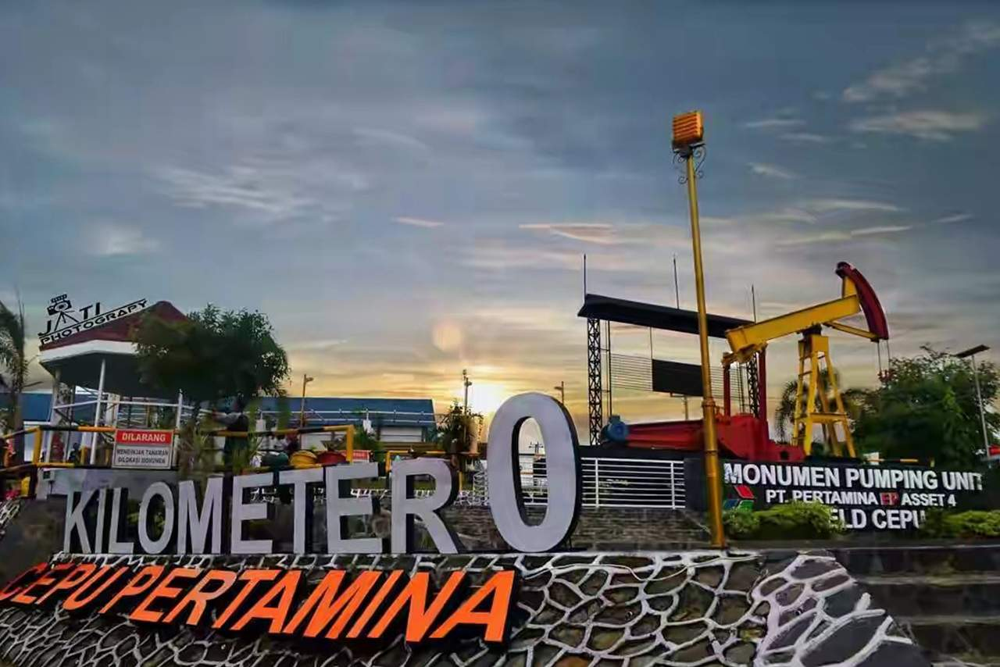

## Jelajah Balikpapan

Sebuah platform web berbasis Laravel yang menampilkan informasi sejarah, wisata, budaya, serta pesona Kota Balikpapan. Data dikelola menggunakan **Supabase PostgreSQL** dan gambar disimpan melalui **Supabase Storage**.

---

# ## Daftar Isi

* [Fitur Utama](#fitur-utama)
* [Tech Stack](#tech-stack)
* [Persyaratan Sistem](#persyaratan-sistem)
* [Instalasi](#instalasi)
* [Konfigurasi](#konfigurasi)
* [Role & Permissions](#role--permissions)
* [Fitur Berdasarkan Role](#fitur-berdasarkan-role)
* [Generate PDF](#generate-pdf)
* [Import Data](#import-data)
* [Screenshot](#screenshot)
* [Struktur Database](#struktur-database)
* [Penggunaan](#penggunaan)
* [Deployment](#deployment)
* [Kontribusi](#kontribusi)
* [Lisensi](#lisensi)

---

# ## **Fitur Utama**

### 🌆 Halaman Utama

* Hero section “Menghidupkan Sejarah, Menggali Pesona Balikpapan”
* Slider landmark kota
* Informasi Visi & Misi, Moto Kota, Maskot Balikpapan

### 🏞 Wisata

* List wisata dari database Supabase
* Detail wisata lengkap (gambar, lokasi, deskripsi)

### 📜 Sejarah

* Daftar artikel sejarah
* Detail sejarah (layaknya blog)
* Kategori sejarah

### 🔍 Pencarian

* Fitur search terintegrasi
* Mencari wisata & sejarah secara bersamaan

### 🏷 Kategori

* Filter berdasarkan kategori
* Data kategori berasal dari Supabase

### 👤 User Profile

* Menampilkan data pengguna (Supabase Auth)
* Logout & session management

---

# ## **Tech Stack**

### **Frontend & Backend**

* Laravel 10
* Blade Template Engine
* Tailwind / Bootstrap

### **Database & Storage**

* Supabase PostgreSQL
* Supabase Storage (gambar wisata & sejarah)

### **Auth**

* Supabase Auth (email/password)

### **Deployment**

* Laravel + Nginx (Cloud VM / Recraft Hosting)

---

# ## **Persyaratan Sistem**

* PHP >= 8.1
* Composer
* Node.js & NPM
* Laravel CLI
* Akun Supabase
* Extension PHP:

  * OpenSSL
  * PDO
  * Mbstring
  * Tokenizer
  * Ctype
  * JSON

---

# ## **Instalasi**

### 1. Clone Repository

```bash
git clone https://github.com/aidilsaputrakirsan-classroom/final-project-cloud-computing-b-cc-kelompok-1-lumina.git
cd final-project-cloud-computing-b-cc-kelompok-1-lumina
```

### 2. Install Dependencies

```bash
composer install
npm install
npm run build
```

### 3. Copy Environment

```bash
cp .env.example .env
```

### 4. Generate App Key

```bash
php artisan key:generate
```

---

# ## **Konfigurasi**

## **1. Konfigurasi Supabase**

Tambahkan pada `.env`:

```env
SUPABASE_URL="https://your-project.supabase.co"
SUPABASE_KEY="public-anon-key"
SUPABASE_BUCKET="balikpapan-storage"
```

## **2. Koneksi API Supabase**

Laravel menggunakan `Http::withHeaders()` untuk fetch data:

```php
Http::withHeaders([
    'apikey' => env('SUPABASE_KEY')
])->get(env('SUPABASE_URL') . '/rest/v1/wisata?select=*');
```

---

# ## **Role & Permissions**

Jika proyekmu memiliki role dari Supabase Auth:

| Role      | Akses                                |
| --------- | ------------------------------------ |
| **Admin** | CRUD seluruh konten                  |
| **User**  | Membaca data, mengelola profile      |
| **Guest** | Akses publik (home, wisata, sejarah) |

---

# ## **Fitur Berdasarkan Role**

### ### 👑 Admin

* Tambah/Edit/Hapus konten wisata
* Tambah/Edit/Hapus artikel sejarah
* Kelola kategori
* Upload gambar ke Supabase Storage
* Export PDF (opsional)
* Import data dari CSV (opsional)

### ### 👤 User

* Lihat konten
* Gunakan fitur pencarian
* Edit profile

### ### 👥 Guest / Tanpa Login

* Mengakses halaman publik
* Melihat daftar wisata & sejarah

---

# ## **Generate PDF**

Jika ada fitur export PDF menggunakan `laravel-dompdf` atau `barryvdh/laravel-dompdf`:

```bash
php artisan dompdf:publish
```

Penggunaan:

```php
$pdf = PDF::loadView('pdf.wisata', compact('data'));
return $pdf->download('wisata.pdf');
```

---

# ## **Import Data**

Jika kamu import data via CSV atau Excel:

1. Upload file ke halaman admin
2. Data diproses dan disimpan ke Supabase melalui API
3. Validasi otomatis

Contoh controller:

```php
$data = Excel::toArray([], $file);
```

---

# ## **Screenshot**

Kamu tinggal masukkan gambar:

```

*Halaman login dengan form email dan password*





```

---

# ## **Struktur Database**

Tabel utama pada Supabase:

### **1. wisata**

| Field     | Tipe    | Keterangan                |
| --------- | ------- | ------------------------- |
| id        | int     | PK                        |
| nama      | varchar | nama wisata               |
| deskripsi | text    | detail wisata             |
| lokasi    | varchar | alamat                    |
| foto_url  | text    | URL dari Supabase Storage |

### **2. sejarah**

| Field       | Tipe    |
| ----------- | ------- |
| id          | int     |
| judul       | varchar |
| isi         | text    |
| kategori_id | int     |
| gambar_url  | text    |

### **3. kategori**

| id | int |
| nama | varchar |

---

# ## **Penggunaan**

### Jalankan server

```bash
php artisan serve
```

Akses di browser:

```
https://lumina.recraft.id/
```

---

# ## **Deployment**

### 1. Siapkan Repository di GitHub

Pastikan seluruh source code Laravel sudah ada di GitHub.
Struktur folder tidak boleh berada di subfolder — harus di root repository.
Pastikan .env.example lengkap, karena Hostinger akan membuat file .env baru.

### 2. Hubungkan Hostinger ke GitHub

Masuk ke hPanel Hostinger
Buka:
Website → Git → Connect Repository

Isi:
Repository URL → repo GitHub kamu
Branch → branch yang dipakai (misal: finalproject_jelajahbalikpapan)
Pilih Deploy to: root folder (atau subfolder jika project-mu tidak di root)
Setelah itu Hostinger akan otomatis:
clone repo
menyiapkan environment
membaca struktur Laravel

### 3. Konfigurasi File .env di Hostinger

Buat file .env di Hostinger lewat File Manager.

Jalankan di terminal Hostinger:

php artisan key:generate --show

### 4. Install Dependency di Hostinger

composer install --optimize-autoloader --no-dev
npm install
npm run build

### 5. Optimasi Laravel
php artisan config:cache
php artisan route:cache
php artisan view:cache

### 6. Set Public Folder yang Benar

Di Hostinger, ubah document root menjadi:

/public

hPanel → Advanced → Configuration → PHP Configuration

Ubah document root ke folder Laravel public/.


### 7. Setelah Semua Berhasil

Akses:

https://lumina.recraft.id/


Website Laravel + Supabase siap digunakan.
```

### ✔ Pastikan folder:

`/storage` → writable.

---

# ## **Kontribusi**

1. Fork repository
2. Buat branch baru
3. Commit perubahan
4. Pull request

---

# ## **Lisensi**

Lisensi proyek ini mengikuti lisensi default yang ada di repository.

---
